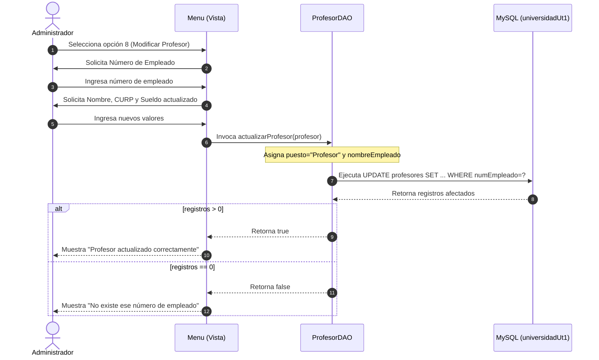

<div align="center">

# 🐺 SISTEMA UNIVERSIDAD UT | MÓDULO DE ACTUALIZACIÓN DOCENTE (UPDATE) 🐺
### *Edición y Mantenimiento de Profesores mediante JDBC & MySQL*
**`Universidad UT` • `Actitud Lobo`**

[](https://www.oracle.com/java/)
[](https://www.mysql.com/)
[](https://maven.apache.org/)
[-f59e0b?style=for-the-badge&logo=edit&logoColor=white)](https://github.com/)
[](https://github.com/)

---

```text
 __  __  ___  ____  ___ _____ ___ ____    _    ____  
|  \/  |/ _ \|  _ \|_ _|  ___|_ _/ ___|  / \  |  _ \ 
| |\/| | | | | | | || || |_   | | |     / _ \ | |_) |
| |  | | |_| | |_| || ||  _|  | | |___ / ___ \|  _ < 
|_|  |_|\___/|____/|___|_|   |___\____/_/   \_\_| \_\
                  🐾 ACTITUD LOBO • INGENIERÍA 🐾
```

</div>

---

## 📋 Ficha Técnica & Datos Académicos

| Campo | Información |
| :--- | :--- |
| 👨‍🎓 **Estudiante / Desarrollador** | **Kurt Cobain Vázquez Sánchez** |
| 👨‍🏫 **Profesor / Asesor** | **René Santos Osorio** |
| 🏛️ **Institución** | Universidad Tecnológica (UT) |
| 🐺 **Identidad Universitaria** | **Actitud Lobo** |
| 📚 **Materia / Área** | Programación Orientada a Objetos & Gestión de Bases de Datos |
| 🧩 **Patrón Arquitectónico** | DAO (*Data Access Object*) + Capa de Negocio & Persistencia |
| 🔌 **Tecnologías** | Java SE 21+/26, JDBC (*MySQL Connector/J 9.7.0*), Apache Maven, MySQL Server |

---

## 🌟 Descripción del Proyecto

El proyecto **Modificar Profesores** del Sistema Universitario de la **Universidad UT** se enfoca en la implementación del flujo de **Modificación y Actualización de Datos Docentes (UPDATE)**. Permite a los administradores actualizar la información laboral y personal de los catedráticos (Nombre, CURP, Sueldo y Puesto) conservando la integridad de su Número de Empleado.

La solución cuenta con asignación automática de roles de nómina (`nombreEmpleado` y `puesto = 'Profesor'`), garantizando consistencia de datos antes de enviar la sentencia `UPDATE` a la base de datos MySQL.

```text
                       ┌────────────────────────┐
                       │  Número de Empleado    │
                       │   (Clave de Búsqueda)  │
                       └───────────┬────────────┘
                                   │
                                   ▼
                       ┌────────────────────────┐
                       │  Nuevos Datos Docente  │
                       │ (Nombre, CURP, Sueldo) │
                       └───────────┬────────────┘
                                   │
                                   ▼
                       ┌────────────────────────┐
                       │   ProfesorDAO (JDBC)   │
                       │ UPDATE profesores SET  │
                       └───────────┬────────────┘
                                   │
                    ┌──────────────┴──────────────┐
                    ▼                             ▼
        ┌───────────────────────┐     ┌───────────────────────┐
        │  Filas Afectadas > 0  │     │  Filas Afectadas = 0  │
        │ "Actualizado con éxito"│    │ "No existe empleado"  │
        └───────────────────────┘     └───────────────────────┘
```

---

## 🚀 Características Principales

- ✏️ **Actualización Docente Dinámica:** Método `actualizarProfesor(Profesor profesor)` en `ProfesorDAO` que ejecuta:
  ```sql
  UPDATE profesores SET nombre=?, curp=?, nombreEmpleado=?, puesto=?, sueldo=? WHERE numEmpleado=?
  ```
- ⚙️ **Normalización Automática de Datos:** Asigna automáticamente el nombre del empleado y el puesto institucional en la entidad `Profesor` previo al envío a MySQL.
- 🛡️ **Validación de Existencia:** Comprobación mediante `stm.executeUpdate() > 0` con mensajes de confirmación o aviso de número de empleado inexistente.
- 🖥️ **Menú Interactivo de 9 Opciones:** Flujo consolidado para gestión de alumnos y modificación especializada de profesores.

---

## 🏗️ Diagrama de Secuencia de Actualización (Mermaid)



---

## 📊 Matriz de Operaciones del Menú

| Opción | Acción | Descripción | Estado |
| :---: | :--- | :--- | :---: |
| `1` | Inscribir Alumno | Alta de alumnos en BD | ✅ |
| `2` | Mostrar Alumnos | Listado general de alumnos | ✅ |
| `3` | Actualizar Alumno | Modificación de datos del alumno | ✅ |
| `4` | Dar de baja Alumno | Eliminación de alumno | Pendiente |
| `5` | Buscar Alumno | Búsqueda por expediente | Pendiente |
| `6` | Agregar Profesor | Alta de nuevo profesor | ✅ |
| `7` | Mostrar Profesores | Listado general de profesores | ✅ |
| `8` | **Modificar Profesor** | **Actualización completa de datos docentes** | ⭐ **Destacado** |
| `9` | Salir | Cierre de la sesión | ✅ |

---

## 🗃️ Script de Base de Datos (MySQL)

```sql
CREATE DATABASE IF NOT EXISTS universidadUt1 CHARACTER SET utf8mb4 COLLATE utf8mb4_unicode_ci;
USE universidadUt1;

CREATE TABLE IF NOT EXISTS profesores (
    numEmpleado INT PRIMARY KEY,
    nombre VARCHAR(100) NOT NULL,
    curp VARCHAR(18) NOT NULL UNIQUE,
    nombreEmpleado VARCHAR(100) NOT NULL,
    puesto VARCHAR(50) NOT NULL,
    sueldo DOUBLE NOT NULL
);

-- Inserción de prueba
INSERT INTO profesores (numEmpleado, nombre, curp, nombreEmpleado, puesto, sueldo) VALUES 
(2001, 'Rene Santos Osorio', 'SAOR750815HDFRRL09', 'Rene Santos Osorio', 'Profesor', 25000.00);
```

---

## 📂 Estructura del Proyecto

```text
UniversidadUT/
├── pom.xml                                   # Configuración de dependencias Maven
└── src/
    └── main/
        └── java/
            └── org/
                └── example/
                    ├── Main.java             # Clase de inicio
                    ├── config/
                    │   └── Conexion.java     # Factoría JDBC
                    ├── dao/
                    │   ├── AlumnoDAO.java    # DAO de Alumnos
                    │   └── ProfesorDAO.java  # DAO con lógica UPDATE de Profesores
                    ├── modelo/
                    │   ├── PersonaUt.java    # Superclase abstracta
                    │   ├── Alumno.java       # Entidad Alumno
                    │   └── Profesor.java     # Entidad Profesor
                    └── vista/
                        └── Menu.java         # Vista de consola (9 opciones)
```

---

## ⚡ Guía de Instalación y Ejecución

```bash
# 1. Clonar el repositorio
git clone https://github.com/tu-usuario/modificar-profesores.git
cd modificar-profesores/UniversidadUT

# 2. Compilar con Maven
mvn clean compile

# 3. Ejecutar la aplicación
mvn exec:java -Dexec.mainClass="org.example.Main"
```

---

## 💻 Demostración de Modificación en Consola

```text
========== MENU ==========
1.- Inscribir Alumno
2.- Mostrar Alumnos
3.- Actualizar Alumno
4.- Dar de baja Alumno
5.- Buscar Alumno
6.- Agregar Profesor
7.- Mostrar Profesores
8.- Modificar Profesor
9.- Salir
==========================
Elige tu opción: 8
Numero de Empleado del profesor a modificar: 2001
Nombre: Rene Santos Osorio
CURP: SAOR750815HDFRRL09
Nombre del Empleado: Rene Santos Osorio
Puesto: Catedrático Titular
Sueldo: 28500.00
Profesor actualizado correctamente
```

---

<div align="center">

### 🐺 ¡Orgullo y Excelencia Académica con Actitud Lobo! 🐺
Desarrollado con dedicación y buenas prácticas de ingeniería de software.

**Universidad Tecnológica • 2026**

</div>
